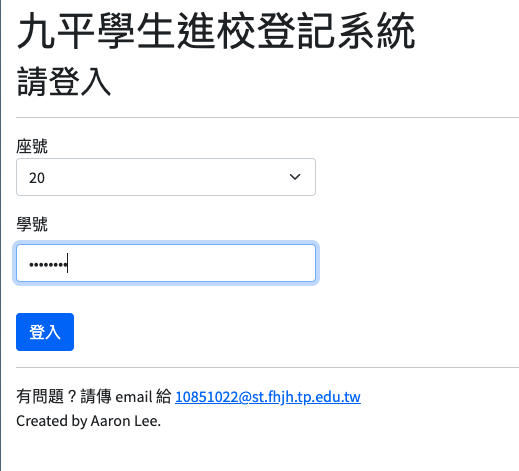
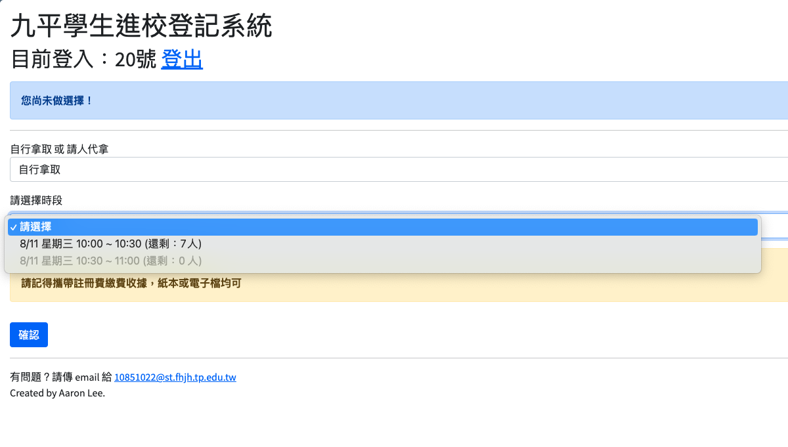
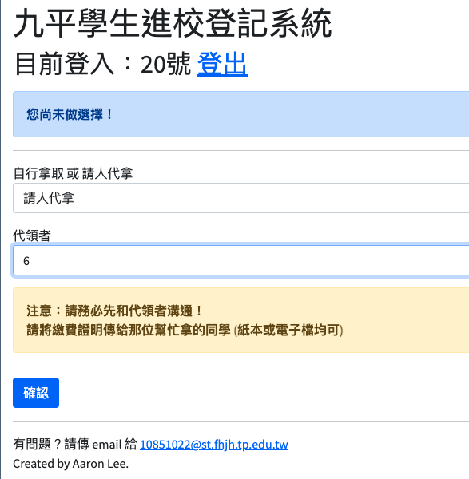
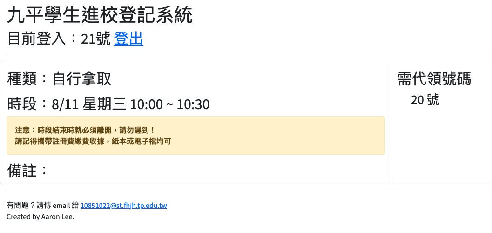
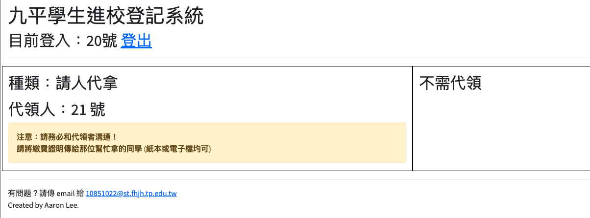
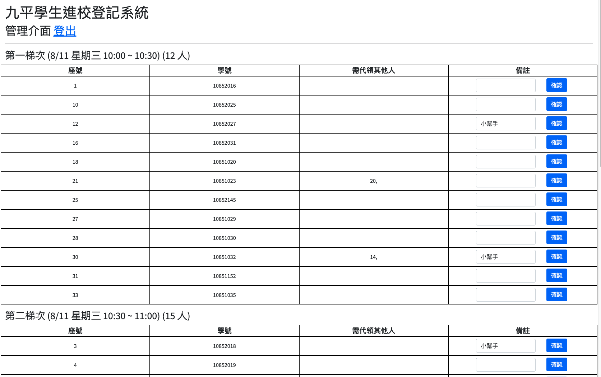

# School Registration

A small registration system I wrote for my class when we had to pick up books during the pandemic. It was useful as the school only allowed a certain number of people to enter at a time.

## Tech Stack

- Flask
- Pyrebase4 (Firebase Realtime Database)
- Bootstrap 5

## Features

- Login by user
- Select a time slot to pick up books or ask for someone to pick up books for you
- Users will be notified by email when they register for a time slot and when someone asks them to pick up books for them
- Admins can view all the time slots and who is registered for each time slot
- Admins can create notes for each user (e.g. "User did not pick up books" or "Helper")

## How to run (local)

1. Clone the repository
2. Create a virtual environment
```bash
python -m venv venv
```
3. Install the dependencies
```bash
pip install -r requirements.txt
```
4. Create a Firebase project and add a Realtime Database
5. Create a SendGrid account and create an API key (you can skip this step if you don't want to send emails)
6. Copy .env.example to .env and fill in the required fields
7. Run the app
```bash
python app.py
```
8. Access the app at http://localhost:80

## How to run (Docker)

1. Clone the repository
2. Create a Firebase project and add a Realtime Database
3. Create a SendGrid account and create an API key (you can skip this step if you don't want to send emails)
4. Copy .env.example to .env and fill in the required fields
5. Build the image
```bash
docker build -t school-registration .
```
6. Run the container
```bash
docker run -d school-registration
```
7. Access the app at http://localhost:80

## Screenshots






